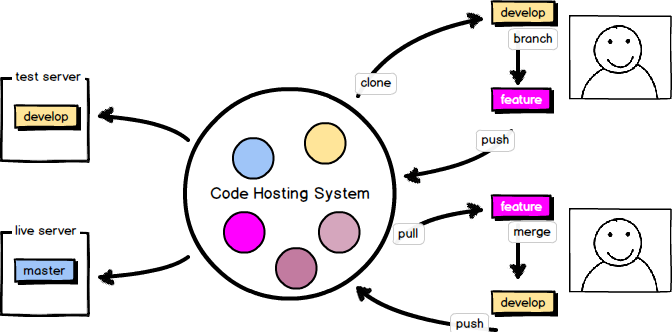
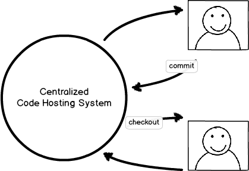
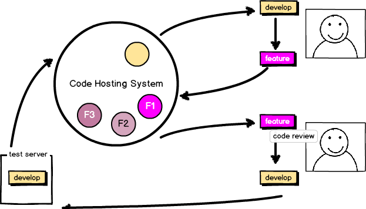
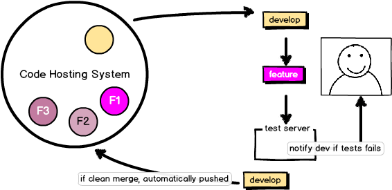
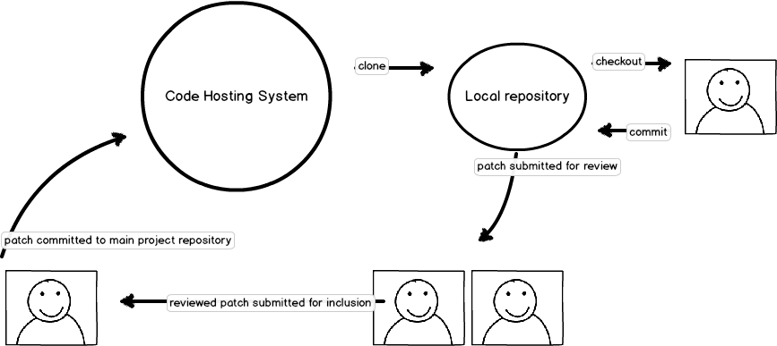
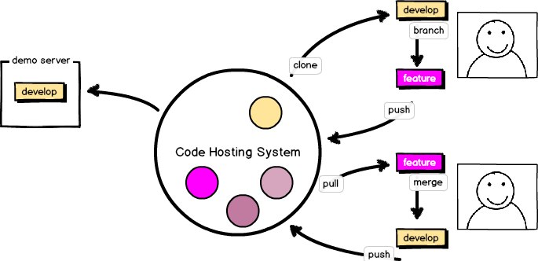

## Warning!

This is not a talk about all the commands you can run in Git.

### Resources for Commands:

- [Mega Resources List o' Links](http://developerworkflow.com/resources/offsite.html)
- [Git Documentation](http://git-scm.com/doc)
- [Pro Git](http://git-scm.com/book)

## Yes, the slides are uploaded

github.com/emmajane/gitforteams

## On an index card...

Write down your answer to:

- REQUIRED: What (workflow-related) **questions** do you need answered today?
- OPTIONAL: How does Emma **get in touch** with you after the workshop to make sure your question(s) were answered?

Note: during the break I'm going to review the index cards to make sure we're on track.

## My Goal for this Workshop

By the end of this session you should be able to:

- Choose a **permission strategy** for your project.
- Choose a **branching strategy** for your project.
- Create project-specific **documentation** which outlines how your team members interact with your code.

## Workshop Outcome: Personalized Documentation

Note: this is where we want to end up by the end of today. You know where each
branch lives. You know how / where a branch is closed.

## slides: github.com/emmajane/gitforteams

Note: You'll want a copy of the slides for reference as we go through the activities. Please open this page now.

==========
# Warm-up  Exercise

## People and Process  Before Commands and Code

## Basic Questions...

- Who has commit access?
- Why do you know your code isn't broken?
- Does your team use test-driven development?
- Do you have an independent quality assurance team?
- Can you deploy "broken" code?

Note: we'll start with the easy questions you MUST be able to answer. Your current answers may help you to uncover problems witn your current setup.

## Activity: Identify Current R&R

1. Write down a list of all of the people/**roles** on your code team.
2. Write a list of the tasks these people/roles are **responsible** for code-wise.

Note: R&R = roles and responsibilities

## Activity: Sketch the Assembly Line

Sketch a time line of how code is incorporated into your project.

- Where do people grab the code from?
- How do people share their work? (branch? patch? fork?)
- Is there a review process?
- Are there barriers to code commits (test suite, QA team)?

Note: right now, there are no wrong answers. It's just a sketch. A rough approximation is fine.

## Example: Centralized

Everyone works in the same centralized repository. There's no peer review or testing.

## Example: Pre-Merge QA Team

A quality assurance team, and optional test suite, decide if your work is acceptable.

Note: or this could be just an automated testbot.

## Example: CI or Post-Merge Test Suite

A testbot notifies you if your work is not acceptable (possibly after adding it to the main branch).

Note: CI assumes everything is good, but notifies you if it's not.

==========
# Part 1

## Project Hosting

When you first create a Git project, you will need to decide who can commit their code to the repository.

Note: Step 1: Identify and describe the governance for your code.

## Overview

- **Dispersed Contributor Model** - Trust No One; Propose *a Solution*
- **Collocated Contributor Repositories** - Trust No One; Show *Your Work*
- **Shared Maintenance** - Trust the Process

## Dispersed Contributor: Trust No One; Propose a Solution

Everyone has read access. Very few have write access. Suggested
changes are presented as whole ideas in a single patch file for
review.

## Dispersed Contributor: Trust No One; Propose *a Solution*

<table>
<tr><th width="50%">Pro</th><th>Con</th></tr>
<tr><td>
<li> Forces a review process.
<li> Works well with git tools (bisect, gitk).
</td>
<td>
<li> Sharing work is more complicated than branching.
<li> Contributors (potentially) need to setup their own code
  hosting platform.
</td>
</tr>
</table>

Note: This is what git was optimized for. It's archaic and
doesn't work well with web-based code hosting and ticketing
platforms such as GitHub.

## Examples of Dispersed Contributors?

<ul class="fragment">
<li>Linux
<li>Drupal
<li>FOSS projects still using a centralized code hosting model OR mailing-list code sharing model
</ul>

Note: Linux, Drupal

## Collocated Contributor Repositories: Trust No One; Show *Your Work*

Project forks give full permissions to developers so they can
do work in any commit granularity they choose. New work is
added to the main project through a request to the upstream
project via a proposed **branch of commits**.

## Collocated Contributor Repositories: Trust No One; Show *Your Work*

<table>
<tr><th width="50%">Pro</th><th>Con</th></tr>
<tr><td>
<li> Forces a review process.
</td>
<td>
<li> Commit granularity may prevent effective debugging. 
<li> Private repos must be duplicated per team member.
<li> More steps to incorporate new work.
</td>
</tr>
</table>

Note: This is the default strategy for public code repositories
with open access for viewing the project. Wrote a resource on
why this may be bad at
http://developerworkflow.com/resources/evolution-social-coding.html

## Examples of Collocated Contributor Repositories?

<ul class="fragment">
<li>Django
<li>Ruby on Rails
<li>CakePHP
<li>FOSS projects hosted on GitHub
</ul>

Note: Django, Rails, CakePHP

## Shared Maintenance: Trust the Process

Developers work in a branch of the centralized code repository. Only the politics of the project prevent them from committing their work to the main body of work.

## Shared Maintenance: Trust the Process

<table>
<tr><th width="50%">Pro</th><th>Con</th></tr>
<tr><td>
<li> Encourages clean/working master.
</td>
<td>
<li> Encourages, but does not *require* code review.
<li> Must give explicit write permission to all team members.
</td>
</tr>
</table>

Note: This is the default strategy for private code repositories with named team members. For BIG projects, it can be time consuming to assign permissions to all devs.

## Examples of Shared Maintenance?

Internal projects with trusted developers

Note: Internal projects using a centralized system (e.g. Git, Hg, bzr) **OR** centralized systems with liberal branching.

## Review

- **Dispersed Contributors** - Trust No One; Propose *a Solution*
- **Collocated Contributors** - Trust No One; Show *Your Work*
- **Shared Maintenance** - Trust the Process

## So What?

- If you choose **shared maintenance**, you need to setup a PRIVATE repository for your code, and grant permission to all team members to push their changes to the server.
- If you choose **collocated repositories**, you need to setup PUBLIC or PRIVATE repository for your code, and ensure all team members to can create their own PUBLIC or PRIVATE copy of the project, AND submit merge requests to the main project.

==========
# Part 2

## Separating Collated Code  with Branching Strategies

Identify and describe how your code is collated within your repository.

## Branching Strategies

- Scheduled Deployment: [Gitflow](http://nvie.com/posts/a-successful-git-branching-model/) 
  or [Simplified Gitflow](http://drewfradette.ca/a-simpler-successful-git-branching-model/)
- Branch-per-Feature: [Branch Per Feature](https://www.acquia.com/blog/pragmatic-guide-branch-feature-git-branching-strategy)
  or [GitHub Flow](http://scottchacon.com/2011/08/31/github-flow.html)
- State Branching: [GitLab Flow](https://about.gitlab.com/2014/09/29/gitlab-flow/)

## Scheduled Deployment

- Optimized for the collation of many smaller changes into a single release.
- Typically used for a download-able product; or web site with a scheduled release cycle (e.g. "Wednesdays").
- Incorporates human-reviews, and possibly automated tests.

Note: if you have the concept of stable releases, hotfixes, point releases, security releases, multiple supported versions, etc, then you need this granularity for your branches. There is always a period of time where you do not trust your code/developers and want to have a separate QA period. Thinking like a download-able product: version 4 vs. version 5 of The Software (a piece of software)

## Branch-per-Feature Deployment

- Code is deployed faster than scheduled releases; assumes all check-ins are deployable.
- Requires (trusted) test coverage.
- Typically uses a mechanical gatekeeper (CI) to check in code to the master branch.
- Often has flippers/flags for fine grained access to in-progress features.
- Fewer branches to maintain / keep updated.

Note: if you don't need the granularity of multiple supported versions, you can probably get away with something closer to this branching strategy. Can you get away with just tags? Do you intend to go back and work on a previous version? As soon as you have the concept of a separate security hotfix, you need to introduce a separate branch. In CD: everything is urgent, so there's not a separation of a really urgent security fix. CI, CD vs CD: http://puppetlabs.com/blog/continuous-delivery-vs-continuous-deployment-whats-diff

## Activity

Which best describes your current setup?

- Scheduled Deployment: [Gitflow](http://nvie.com/posts/a-successful-git-branching-model/) 
  or [Simplified Gitflow](http://drewfradette.ca/a-simpler-successful-git-branching-model/)
- Branch-per-Feature: [Branch Per Feature](https://www.acquia.com/blog/pragmatic-guide-branch-feature-git-branching-strategy)
  or [GitHub Flow](http://scottchacon.com/2011/08/31/github-flow.html)
- State Branching: [GitLab Flow](https://about.gitlab.com/2014/09/29/gitlab-flow/)
  
 On the sketch diagram you created previously, add a CIRCLE (or a triangle, or a pony) around the collation points for code. These represent new branches. Where possible, REDUCE the number of collation points because merging out-of-date branches is a potential pain point.

## So What?

- If you choose **SCHEDULED DEPLOYMENT**, streamline how your code is collated for release.
- If you choose **BRANCH-PER-FEATURE**, codify how trust is deployed in your code.
- If you choose **STATE BRANCHING**, establish your infrastructure and automate where possible.

==========
# Part 3

## Commit Granularity

The Great Rebase Debate

## super nerdy rant alert!

[Evolution of Social Coding](http://developerworkflow.com/resources/evolution-social-coding.html)

## What is a Commit

A record of the changes to the repository.

Note: let's start with the very, very basics. A commit is a record of change.

## How can we use Commits

- log
- gitk
- blame
- bisect

Note: We use commits when we look at our project's history. We also use commits to debug our code with "advanced" tools, such as bisect.

## Sharing Work: A brief history lesson

The patch workflow and `git am`.

<blockquote>The commit message is formed by the title taken from the "Subject: ", a blank line and the body of the message up to where the patch begins.</blockquote>

**In other words: a commit is a whole idea.**

Note: the Linux kernel developers chose to use a patching workflow and created command line tools to support this branching strategy.

## Sharing Work: Today

`git push`

Shares an entire branch, with all your micro commits.

## Compare: bzr

Note: branches are collapsed by default; there is a sane commit message when the branch is merged into master (unlike git which gives you a default "merged!" message)

## Problem!

Git tools are COMMIT-aware, not BRANCH-aware.

- gitk
- bisect

## Solution!

`git rebase`

<blockquote>Forward-port local commits to the updated upstream head</blockquote>

In English: re-draw the graph for the commit history as if the rebased commits were already in the history when you did your work.

## Solution!

`git rebase -i`

<blockquote>Make a list of the commits which are about to be rebased. Let the user edit that list before rebasing. This mode can also be used to split commits (see SPLITTING COMMITS below).</blockquote>

In English: combine, or separate, any commits previously made.

## Yes, Re-write History

Because the tools used to interpret history are crude, the recommended approach is simply to fix history.

*TWITCH*

But this is how Git works. So there you go.

## /rant

[Evolution of Social Coding](http://developerworkflow.com/resources/evolution-social-coding.html)

## So What?

Discuss with your team how they want to find bugs, and therefore **HOW your commits should be recorded**.

Note: are you social coding? Or are you using git as it was designed to work with the command line tools it ships with?

==========
# Part 4

## Putting it all Together

- These examples are pulled from Drupalize.Me when I was working as their PM and sometimes front end dev.
- This is a product with no external stakeholders.
- YMMV, YOLO, etc.

Note: these are both in the resources for the repository

## Project Highlights

- Drupal 6 -> Drupal 7 upgrade
- Aiming for speed of work, not stability.
- Changes were **not** being deployed to the live server.
- No weekly demos (which you might have for client work).
- Total time: 18 months.
- [Star Wars Sprintflow](../../resources/workflow-sample-starwars.md)

## Some Notes on Naming

- Use terms which resonate with your team (MVP -> LBB).
- Giving a descriptive name to projects and processes allows you to change the meaning by changing the name.
- There are a lot of Ewoks.
- There are more My Little Ponies.

## The Star Wars Workflow

Note: pre-launch: peer review with branched permission strategy; separate QA server where work is available for review, but typically devs just look at their local version of the current dev branch.

## Whispering Pines Workflow

- Aiming for stability first, speed second.
- Some test coverage.
- Changes are collated weekly onto a QA server, and deployed from there.

## Whispering Pines Workflow Documentation

github.com/emmajane/gitforteams

- [Whispering Pines Weekly Workflow](../../resources/workflow-sample-whisperingpines-code.md)
- [Release philosophy](../../resources/workflow-sample-whisperingpines-releasecycle.md)
- [Deployment](../../resources/workflow-sample-whisperingpines-deployment.md)

## Penultiate Activity: Sketch Your Workflow

- Restructure your previous diagrams to include the intrastate where code is collated.
- Add arrows to represent the direction code travels.
- To the arrows, add the git commands which you'd use.
- Create a written narrative which describes the EXACT commands people should use to move code through the process. (See previous slide for examples.)

## Last Thing

<table>
<tr>
<th width="50%">Index Card</th>
<th>Online</th>
</tr>
<tr>
<td>
<li>What did you learn?
<li>What is (still) confusing?
<li>What will you change for your project?
</td>
<td>
<li>Give us your feedback.
<li>http://www.oscon.com/open-source-2015/public/schedule/detail/40461
</td>
</tr>
</table>

==========
# Resources

- [Git for Teams](http://www.gitforteams.com/)
